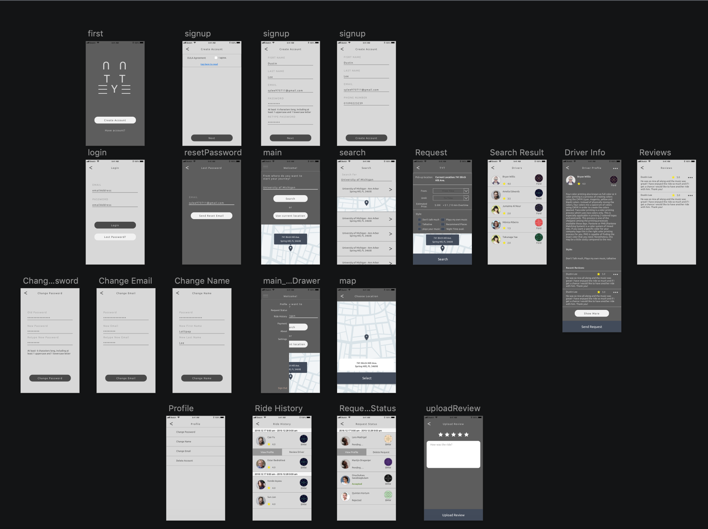
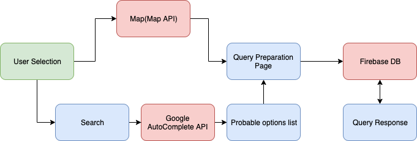

# TakeYouThere-IOS (TYT)

## Introduction

TakeYouThere, or TYT, is a native IOS Swift application to connect Drivers and Personal Riders in 
mutual promise of payment by the customers and satisfactory +  luxurious customer 
service by the drivers.

Original purpose of the app is to:

1. TYT hires drivers who can provide tour to the city you wish to visit.

2. TYT hand picks the drivers who can provide the best service.

3. Black box is mandatorily installed in the car for your safety.

4. Tell TYT your music style, communication style, driving style, etc that you like.

5. Customize your travel experience according to your own taste.

TYT is a prototype to implement design and to visualize the idea.
While the code will run, mid and after driving segments of the application is 
not implemented.

TYT uses Google API for its map and search query, and Firebase for database.
Stripe Token is generated through a Python server.

## Components

### UI/UX Design

The intended customers for this application are normally the travellers with the need to travel around the region continuously. The prerequisite for the drivers are that they are professional, as well as knowledgeable of the region nearby. In order to give the feeling of these important aspects of the service, The theme is geared towards simplistic modern look.

The design of the Application aims to give the simplest experience in planning, choosing, and paying for trips. The UI focuses on few major elements; maps and text details. The importance of map in a travel platform is huge as it allows users to visualize the trip and make both the beginning point and the destination of the user's plan.

By using a sidedrawer to include all miscellaneous(other than the reservation process) tasks, the users are able to find where to find to manage reserved trips and payments, as well as settings for account and the application itself.

Moreover, ratings are crucial in a driver-based travel platform, as alleviating safety concerns is one of persisting goals in general travel industry. To suffice, the end portion of the application will be including a mandatory(at least a star) rating for the other users to use. 

### Core Algorithm

The reserve process goes with the following steps:

1. The user decides to pick from the map or search a location for the vehicle to arrive.  
2. Based on user's current location, trigger Google Autocomplete and return probable results through pagination.
3. When the user clicks on a location, send the location to the next page where different options for a driver can be specified for query.
4. Query firebase with the specified filters and indexes and returns the list of drivers through pagination.
5. User may view the driver's information(including ratings, car type, style, and reviews).
6. When the user chooses the driver, a request is sent to the driver and the rest will be dealt in the TYT Driver Application.

## Prerequisites

* Latest XCode
* Cocoapod installed to computer

***Stripe Payment is in a prototype stage. Payment section will not run correctly.

## Acknowledgments

* See Podfile

## License

Copyright © 2019 by Seung Yoon Lee
All rights reserved. 